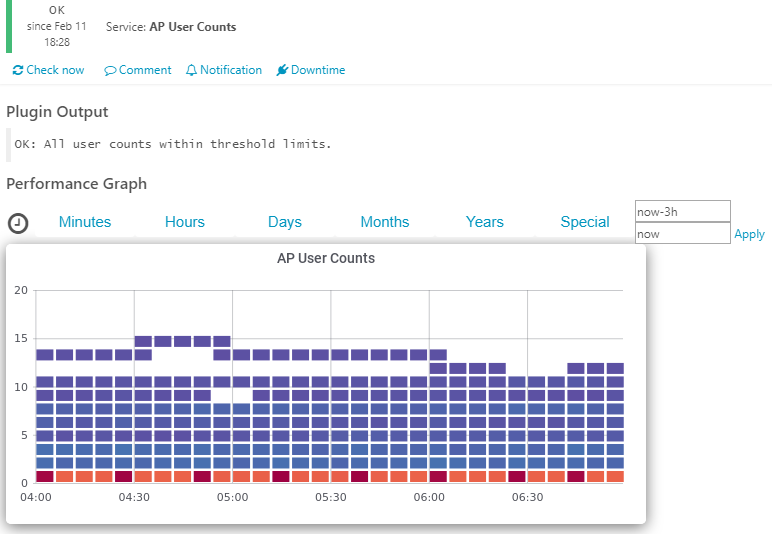
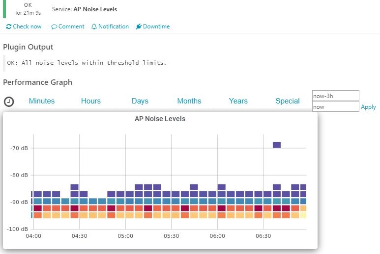

# check_aruba_ap
Checks Aruba AP Information by connecting to Aruba Controller.

Verbose option available on all metrics for more detailed output - see AP User Count images for an example.

### **AP Up/Down Status**


### **AP RX/TX/Radio Utilization**


### **AP Traffic Utilization**


### **AP User Count**

###### Simple (No Alerts)



###### Simple (With Alerts)


###### Verbose


### **AP Noise Level**



## Getting Started

These instructions assume your Icinga2 is installed on a RHEL/CentOS system.  You may need to modify slightly to work with other systems.

### Prerequisites

Net-SNMP (http://www.net-snmp.org/)

Nagios plugins installed and located in /usr/lib64/nagios/plugins

### Installing

Download and install Net-SNMP.  If you choose to build from source use the following lines:
```
./configure --with-perl-modules --with-mibdirs --enable-shared
make
make test
make install
```

Copy check_aruba_ap into your plugin directory and give it executable writes:

```
sudo cp ./check_aruba_ap /usr/lib64/nagios/plugins/
chmod a+x /usr/lib64/nagios/plugins/check_aruba_ap
```

Copy aruba-ap.conf into plugins-contrib.d folder:

```
sudo cp ./aruba-ap.conf /usr/share/icinga2/include/plugins-contrib.d/
```
Append services-aruba-ap.conf to the end of your Icinga2 services.conf:

```
cat ./services-aruba-ap.conf >> /etc/icinga2/conf.d/services.conf
```

This script writes to the /tmp folder and needs to be added to sudoers for the username icinga.

If your installation is running on a different username, change it before copying the file:

```
icinga ALL = NOPASSWD: ICINGA2

to:

<YOUR USERNAME> ALL = NOPASSWD: ICINGA2
```

Copy sudoer file to proper place:

```
sudo cp ./icinga-sudoer /etc/sudoers.d/icinga
sudo chmod 0440 /etc/sudoers.d/icinga
```

Extract Aruba MIB files:

```
sudo  tar -xzvf ./aruba-mibs.tgz /usr/share/snmp/mibs/
```

Set proper MIB folder permissions:

```
sudo chown -R root:icinga /usr/share/snmp/mibs
sudo chmod -R ug+rw /usr/share/snmp/mibs
```

Restore SELINUX permissions:

```
sudo restorecon -R -v /usr/lib64/nagios/plugins/
sudo restorecon -R -v /usr/share/snmp/mibs
```

If using Grafana, import JSON Dashboard (Graphite or InfluxDB) file and add graph dashboard information into module making sure to name the Dashboard aruba-controller:


```
sudo cat aruba-controller-graphs.ini >> /etc/icingaweb2/modules/grafana/graphs.ini
```

Restart Icinga2:

```
sudo systemctl restart icinga2
```
